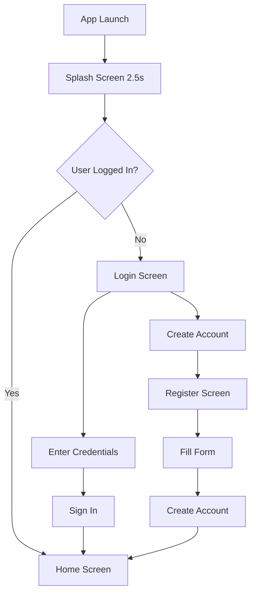
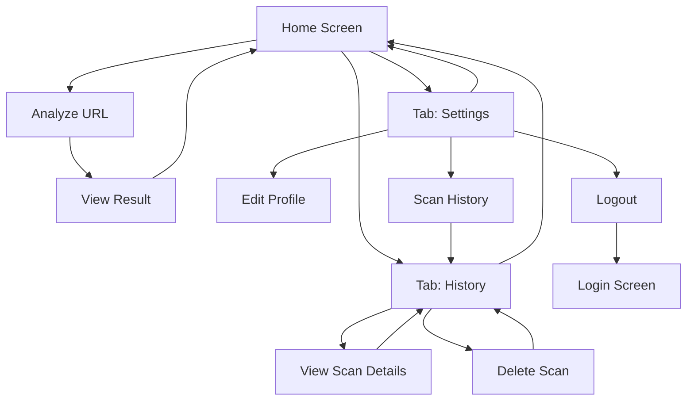
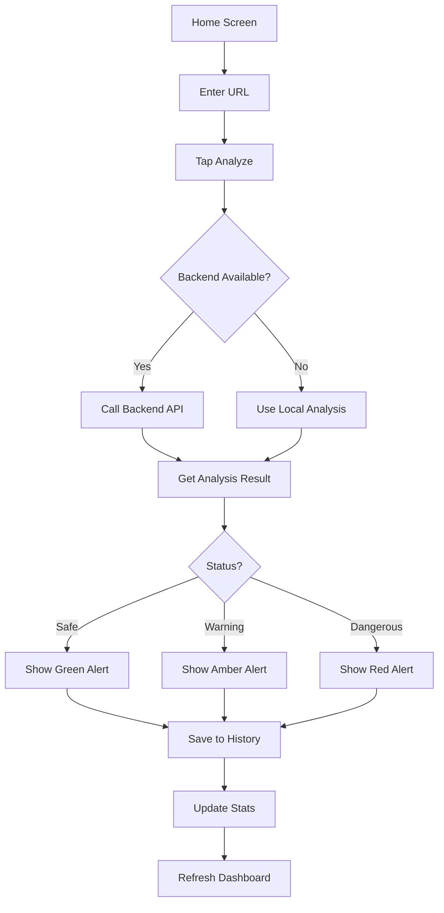
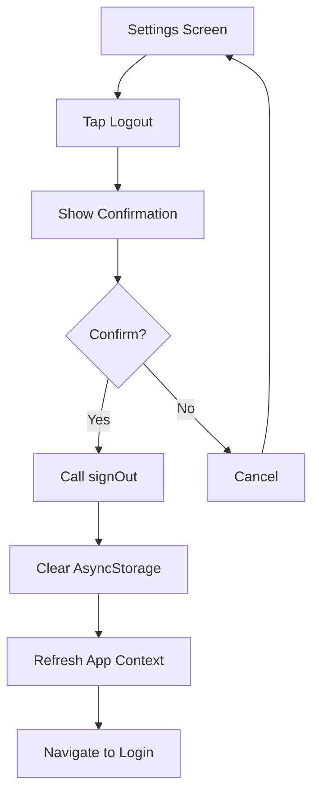

# PhishGuard UI/UX Design Guide

## 🎨 Design System

### Color Palette
```
Primary Colors:
- Background Dark: #0A0F1C
- Background Medium: #0F172A
- Background Card: #1E293B
- Accent Green: #10B981
- Text Primary: #FFFFFF
- Text Secondary: #94A3B8
- Text Tertiary: #64748B

Status Colors:
- Safe: #10B981 (Green)
- Warning: #F59E0B (Amber)
- Dangerous: #EF4444 (Red)

Gradients:
- Main Background: ['#0A0F1C', '#0F172A', '#1E293B']
- Shield Icon: rgba(16, 185, 129, 0.15)
```

### Typography
```
Headings:
- H1: 28px, Bold, Letter Spacing 1
- H2: 24px, Bold
- H3: 18px, SemiBold

Body:
- Body Large: 16px, Regular
- Body Medium: 14px, Regular
- Body Small: 12px, Regular

Buttons:
- Button Text: 16px, Bold, Letter Spacing 0.5
```

### Spacing System
```
Padding:
- Small: 8px
- Medium: 16px
- Large: 24px
- XLarge: 32px

Gap:
- Tight: 8px
- Normal: 16px
- Loose: 24px
```

### Components

#### Logo Component
```
Structure:
- Shield Icon (48px) in circular container
- Circle: 96x96px, rgba(16, 185, 129, 0.15) background
- Border: 2px, rgba(16, 185, 129, 0.3)
- Text: "PhishGuard", 28px Bold, Letter Spacing 1
```

#### Input Field Component
```
Structure:
- Container: flex-row, backgroundColor #1E293B
- Border: 1px, rgba(148, 163, 184, 0.2)
- Corner Radius: 12px
- Icon: 20px, color #64748B, margin-left 16px
- Input: flex 1, padding 16px, color #FFFFFF
- Placeholder: color #64748B
```

#### Primary Button
```
Style:
- Background: #10B981
- Corner Radius: 12px
- Padding: 16px vertical
- Shadow: color #10B981, opacity 0.3, radius 8px
- Content: Icon + Text with 8px gap
- Text: 16px Bold, color #FFFFFF, Letter Spacing 0.5
```

#### Secondary Button
```
Style:
- Background: transparent
- Border: 2px, color #10B981
- Corner Radius: 12px
- Padding: 16px vertical
- Content: Icon + Text with 8px gap
- Text: 16px Bold, color #10B981, Letter Spacing 0.5
```

---

## 📱 Screen Designs

### 1. Splash Screen
**Purpose:** App launch animation

**Elements:**
- Full screen gradient background
- Centered ShieldCheck icon (64px)
- "PhishGuard" text below
- Loading animation
- Duration: 2.5 seconds

**Layout:**
```
┌─────────────────────┐
│   Gradient BG       │
│                     │
│                     │
│    [Shield Icon]    │
│    PhishGuard       │
│    ●●●●●            │
│                     │
│                     │
└─────────────────────┘
```

---

### 2. Login Screen
**Route:** `/(auth)/login`

**Elements:**
- Logo section (Shield icon + PhishGuard text)
- Title: "Welcome Back"
- Subtitle: "Sign in to protect yourself from cyber threats"
- Email input field (with Mail icon)
- Password input field (with Lock icon)
- "Forgot password?" link
- Primary button: "Sign In" (with ArrowRight icon)
- Divider: "OR"
- Secondary button: "Create Account" (with UserPlus icon)
- Footer: Terms & Privacy text

**Layout:**
```
┌─────────────────────┐
│   [Shield Logo]     │
│   PhishGuard        │
│                     │
│   Welcome Back      │
│   Sign in to...     │
│                     │
│ 📧 Email Address    │
│ [Input Field.......]│
│                     │
│ 🔒 Password         │
│ [Input Field.......]│
│                     │
│ Forgot password?    │
│                     │
│ [Sign In Button]    │
│                     │
│   ─── OR ───        │
│                     │
│ [Create Account]    │
│                     │
│ Terms & Privacy...  │
└─────────────────────┘
```

**Lucide Icons Used:**
- Shield (Logo)
- Mail (Email input)
- Lock (Password input)
- ArrowRight (Sign in button)
- UserPlus (Create account button)

---

### 3. Register Screen
**Route:** `/(auth)/register`

**Elements:**
- Logo section (Shield icon + PhishGuard text)
- Title: "Create Account"
- Subtitle: "Join PhishGuard and protect yourself..."
- Name input field (with User icon)
- Email input field (with Mail icon)
- Password input field (with Lock icon)
- Confirm Password input field (with KeyRound icon)
- Terms checkbox
- Primary button: "Create Account" (with ArrowRight icon)
- Sign in link (with LogIn icon)

**Layout:**
```
┌─────────────────────┐
│   [Shield Logo]     │
│   PhishGuard        │
│                     │
│   Create Account    │
│   Join PhishGuard...│
│                     │
│ 👤 Full Name        │
│ [Input Field.......]│
│                     │
│ 📧 Email Address    │
│ [Input Field.......]│
│                     │
│ 🔒 Password         │
│ [Input Field.......]│
│                     │
│ 🔑 Confirm Password │
│ [Input Field.......]│
│                     │
│ ☑ I agree to Terms  │
│                     │
│ [Create Account]    │
│                     │
│ < Already have...?  │
└─────────────────────┘
```

**Lucide Icons Used:**
- Shield (Logo)
- User (Name input)
- Mail (Email input)
- Lock (Password input)
- KeyRound (Confirm password input)
- ArrowRight (Create button)
- LogIn (Sign in link)

---

### 4. Home/Dashboard Screen
**Route:** `/(tabs)/index`

**Elements:**
- Header with greeting
- Stats cards (3 cards):
  - Threats Blocked
  - Protection Active
  - Scans Total
- URL input section
- Analyze button
- Recent Scans section (last 3 scans with status)
- Bottom tab navigation

**Layout:**
```
┌─────────────────────┐
│ 🛡 Hello, User      │
│                     │
│ ┌─────┐ ┌─────┐    │
│ │2847 │ │ 86% │    │
│ │Block│ │Safe │    │
│ └─────┘ └─────┘    │
│                     │
│ 🔍 Scan URL         │
│ [Input URL.......]  │
│ [Analyze URL]       │
│                     │
│ Recent Scans        │
│ ✓ google.com        │
│ ⚠ suspicious.net    │
│ ✗ phishing.xyz      │
│                     │
│ [🏠] [📋] [⚙️]      │
└─────────────────────┘
```

**Lucide Icons Used:**
- Shield (Header)
- ShieldCheck (Protection card)
- AlertCircle (Warnings card)
- BarChart3 (Scans card)
- Search (URL input)
- CheckCircle (Safe scans)
- AlertTriangle (Warning scans)
- XCircle (Dangerous scans)

---

### 5. History Screen
**Route:** `/(tabs)/history`

**Elements:**
- Header: "Scan History"
- Filter buttons (All, Safe, Threats)
- Scan list with:
  - Status icon
  - URL
  - Timestamp
  - Delete button
- Empty state message
- Pull to refresh
- Bottom tab navigation

**Layout:**
```
┌─────────────────────┐
│ Scan History        │
│ View all your...    │
│                     │
│ [All] [Safe] [Threat│
│                     │
│ ✓ google.com        │
│   2:34 PM       [🗑]│
│                     │
│ ⚠ suspicious.net    │
│   5:12 PM       [🗑]│
│                     │
│ ✗ phishing.xyz      │
│   11:45 AM      [🗑]│
│                     │
│                     │
│ [🏠] [📋] [⚙️]      │
└─────────────────────┘
```

**Lucide Icons Used:**
- CheckCircle (Safe scans)
- AlertTriangle (Warning scans)
- XCircle (Dangerous scans)
- Trash2 (Delete button)

---

### 6. Settings Screen
**Route:** `/(tabs)/settings`

**Elements:**
- Header with Settings icon
- Profile card:
  - Avatar circle with UserCircle icon
  - User name
  - User email
- Stats cards (2 cards):
  - Total Scans
  - Threats Blocked
- Account section:
  - Edit Profile
  - Change Password
- Security section:
  - Two-Factor Authentication
  - Scan History
- Preferences section:
  - Notifications
  - Dark Mode
- Logout button
- Bottom tab navigation

**Layout:**
```
┌─────────────────────┐
│ ⚙️ Settings         │
│                     │
│ ┌─────────────────┐ │
│ │ 👤 User Name    │ │
│ │ user@email.com  │ │
│ └─────────────────┘ │
│                     │
│ ┌───────┐ ┌───────┐ │
│ │  156  │ │  42   │ │
│ │ Scans │ │Threats│ │
│ └───────┘ └───────┘ │
│                     │
│ 🌐 ACCOUNT          │
│ Edit Profile     >  │
│ Change Password  >  │
│                     │
│ 🛡️ SECURITY         │
│ 2FA                 │
│ Scan History     >  │
│                     │
│ 🎨 PREFERENCES      │
│ Notifications       │
│ Dark Mode           │
│                     │
│ [Logout Button]     │
│                     │
│ [🏠] [📋] [⚙️]      │
└─────────────────────┘
```

**Lucide Icons Used:**
- Settings (Header)
- UserCircle (Avatar)
- Globe (Account section)
- Edit (Edit profile)
- Lock (Change password)
- ShieldCheck (Security section, 2FA)
- BarChart (Scan history)
- Palette (Preferences section)
- Bell (Notifications)
- Moon (Dark mode)
- LogOut (Logout button)
- ChevronRight (Navigation arrows)

---

### 7. Bottom Tab Navigation
**Always Visible**

**Tabs:**
1. Home (Shield icon)
2. History (History icon)
3. Settings (Settings icon)

**Style:**
- Background: #1E293B with gradient border
- Active tab: #10B981 color
- Inactive tab: #64748B color
- Icons: 24px
- Labels: 12px, SemiBold

**Layout:**
```
┌─────────────────────┐
│                     │
│ [Content Area]      │
│                     │
│                     │
├─────────────────────┤
│ [🛡️]  [📋]  [⚙️]   │
│ Home History Settings│
└─────────────────────┘
```

---

## 🔄 App Workflow

### Authentication Flow


### Main Navigation Flow


### URL Analysis Flow


### Logout Flow


---

## 🎯 Key Features

### 1. Authentication System
- ✅ Local storage using AsyncStorage
- ✅ User session management
- ✅ Protected routes
- ✅ Auto-redirect based on auth state
- ✅ Simple user ID generation

### 2. URL Analysis
- ✅ Backend API integration
- ✅ Local fallback analysis
- ✅ Risk score calculation
- ✅ Threat detection
- ✅ Real-time results

### 3. Scan History
- ✅ View all scans
- ✅ Filter by status (All/Safe/Dangerous)
- ✅ Delete individual scans
- ✅ Pull to refresh
- ✅ Backend data sync

### 4. User Profile
- ✅ Display user info
- ✅ Real-time statistics
- ✅ Scan count
- ✅ Threats blocked count

### 5. Settings Management
- ✅ Profile display
- ✅ Statistics cards
- ✅ Navigation to history
- ✅ Logout functionality
- ✅ Confirmation dialogs

---

## 📐 Design Specifications

### Screen Dimensions
- Width: 375px (iPhone base)
- Height: 812px (iPhone base)
- Safe Area: Account for notch/home indicator

### Touch Targets
- Minimum: 44x44px
- Recommended: 48x48px
- Buttons: 48px height minimum

### Icon Sizes
- Small Icons: 16px
- Standard Icons: 20px
- Large Icons: 24px
- Logo Icons: 48px

### Border Radius
- Input Fields: 12px
- Buttons: 12px
- Cards: 16px
- Logo Circle: 48px

### Shadows
- Buttons: 0px 4px 8px rgba(16, 185, 129, 0.3)
- Cards: 0px 8px 12px rgba(0, 0, 0, 0.4)
- Inputs: 0px 2px 6px rgba(0, 0, 0, 0.3)

---

## 🔧 Implementation Notes

### Lucide Icons Library
All icons use `lucide-react-native` package:
```typescript
import { Shield, Mail, Lock, User, etc. } from 'lucide-react-native';
```

### Gradient Background
All screens use LinearGradient:
```typescript
<LinearGradient colors={['#0A0F1C', '#0F172A', '#1E293B']}>
```

### Navigation
- expo-router for file-based routing
- (auth) group for authentication screens
- (tabs) group for main app screens
- Custom navigation guards in _layout.tsx

### State Management
- AppContext for global user state
- AsyncStorage for persistence
- useApp() hook for accessing auth state

### API Integration
- Custom api client in config/api.ts
- Type-safe endpoints with TypeScript
- Error handling with fallback logic
- Backend URL from environment variable

---

## 📱 Responsive Considerations

### Phone Sizes Support
- Small (iPhone SE): 320px width
- Medium (iPhone 12): 390px width
- Large (iPhone Pro Max): 428px width

### Tablet Considerations
- Use flex layouts
- Maintain aspect ratios
- Scale icon sizes proportionally

### Orientation
- Primary: Portrait mode
- Lock orientation for consistency

---

## 🎨 Animation Guidelines

### Transitions
- Screen transitions: 300ms ease-in-out
- Button press: scale(0.95), 150ms
- Loading spinners: continuous rotation

### Feedback
- Button press: slight scale down
- Success: green flash
- Error: red flash + shake

### Performance
- Use native animations where possible
- Avoid heavy re-renders
- Optimize image loading

---

## ✅ Accessibility

### Text Sizing
- Minimum: 12px
- Body: 14-16px
- Headers: 18-28px
- Support dynamic type

### Color Contrast
- Text on dark: ratio > 4.5:1
- Icons: high contrast colors
- Status colors clearly distinguishable

### Touch Targets
- Minimum 44x44px
- Spacing between targets
- Visual feedback on press

---

## 🚀 Future Enhancements

### Planned Features
1. Biometric authentication (Face ID/Touch ID)
2. Push notifications for threats
3. URL scanning from clipboard
4. Scan history export
5. Advanced filtering options
6. Theme customization
7. Multi-language support
8. Onboarding tutorial

### Technical Improvements
1. Offline mode with better caching
2. Real-time threat updates
3. Machine learning integration
4. Enhanced analytics
5. Performance optimization
6. Better error recovery

---

## 📝 Notes

- All colors use consistent naming
- Icons from Lucide library for consistency
- Professional, modern design aesthetic
- Dark theme throughout
- Green accent for security/safety theme
- Clear visual hierarchy
- Intuitive navigation patterns
- Minimal user friction
- Fast performance
- Accessible design

---

**Last Updated:** February 21, 2026
**Version:** 2.0
**Design Status:** ✅ Complete & Implemented
